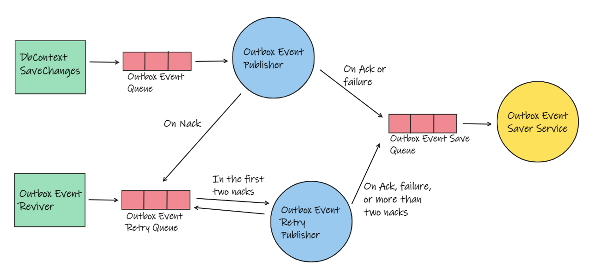

# Outbox Pattern
An outbox pattern implementation using EF Core and RabbitMQ with publish confirms. Heavily inspired on Elixir/Erlang actor model.

This implementation of the outbox pattern is a proof of concept of a resilient system with asynchronous communication between its moving parts ("actors") being made between messages.

The communication between the "Actors", in this case background services, are made using dotnet channels. The base implementation resides on Common/Outbox folder and has four background services ("actors") for :
- Publishing messages that has just been created;
- Retrying publish nacked/failed messages;
- Querying the failed/unpublished messages from database;
- Updating the messages status on database

This implementation is meant to be light weight, the outbox messages rely only on dapper for database communication and the official RabbitMq client to communicate with the broker. EF Core is used on Work Generator to simulate an API persisting the outbox event on database on the same business code transaction.
Also, these four services are resilient, they are capable to handle and recover from failures.

Below an example of a momentarily communication failure with the message broker.

Although being an console app it tries to emulate an ASP. NET api through the worker generator class. This means, that it can be easily ported to an web api, for an example.

## Message flow
The message has two main flows.

1. Coming from a DbContext.SaveChanges transaction
2. Being revived after a failure or three consecutive nacks

### Coming from a DbContext.SaveChanges transaction

When DbContext.SaveChanges is called, all Domain Events in the transaction are saved to the Outbox table on the database. If the SaveChanges succeeds, the events are sent to the internal "Outbox Event Queue" without querying the database.

The "Outbox Event Publisher" listen to this queue and try publish the event on RabbitMq. If the event publishing succeeds, or a critical failure occurs, the event is redirected to the "Outbox Event Save Queue" to have its status updated on the database.

If the event publishing fail due a nack, the message is redirected to the "Outbox Event Retry Queue". The "Outbox Event Retry Publisher" listen to this queue and tries to publish the event two times. What ever result be, the event is sent to the "Outbox Event Save Queue" to be updated on database.

### Being revived after a failure or three consecutive nacks

Failed, Nack or Unpublished messages are queried from database every five minutes and send to the "Outbox Event Retry Queue"   starting the flow from there.
Event reviver only look for messages that are unpublished or not retried on the last five minutes, to avoid re-publishing messages that are in memory.

## Details
- SaveChanges is not blocked if Outbox Event Queue is full, the just created event is dropped from memory and the method returns instantly, some time later the event'll be revived anyway;
- Event reviver keep tracks of revived events for five minutes to avoid reviving an event that still in memory awaiting for an ack or nack;
- Events status are saved on database in batches of 10.000 messages, or if has around one minute since the last trip to database. It works like debounce, if the database was recently called to save the batch status, the next save is delayed until 10k pending messages or one minute since last save. And of course, if there's nothing to be saved, database is never called.

## Running

Go to src\Sender and edit the appsettings.json values for database connection string and RabbitMq connection properties.
Then open the terminal on the main folder and run the following command:

`
dotnet run --project "src\Sender"
`

## Some numbers
Tests made with an i7-10510U with local RabbitMq and Postgres instances:
- The time to publish 50k artificial messages is 14s (without simulating requests, just creating and publishing the messages);
- Simulating ASP .NET requests, it can publish 50k messages in 2 minutes and 14s (the bottleneck is on the request side).

## It can scale?
Depends, if it will be used with microservices that each one has an indepent database, nothing need to change. To using with services that share one database will be necessary to separate the Event Retryer and the Event Reviver to another project/process.
